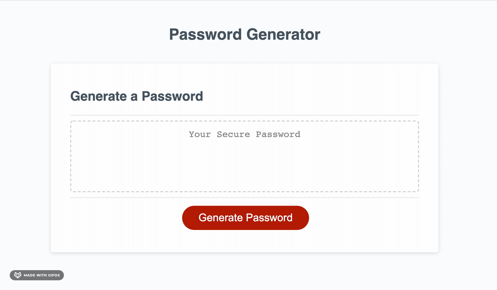

# 03-Password-Generator

### Description

This project aims to create a password generator. It allows users to choose the length of password and users at least make sure to include at least uppercase, lowercase, symbols and numbers in their password phrase.

Simply speaking, a password will be generated after users click generate button and input their desired password criteria.

### Requirements

-   The length of the password is at least 8 characters and no more than 128 characters.

-   Users' input should be validated and at least one character type (uppercase, lowercase, symbol, number) should be selected.

-   The password is either displayed in an alert or written to the page.

#### Demo

